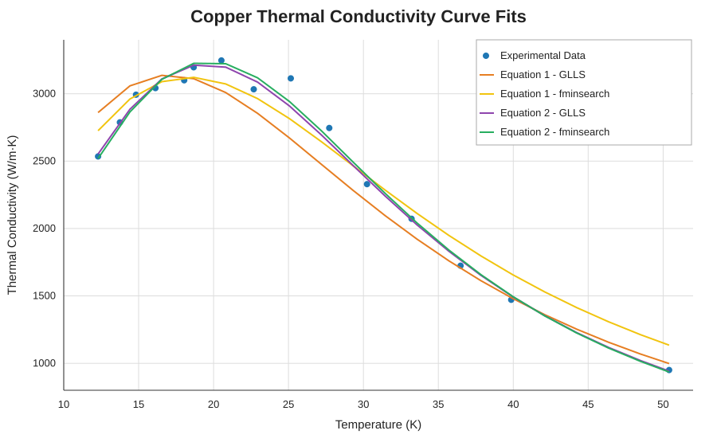

# MATLAB Curve Fitting Project

This project uses curve fitting methods in MATLAB to model the relationship between temperature and the thermal conductivity of copper. I used experimental temperature and thermal conductivity data and tested two different model equations.

For each equation, I used two methods: General Linear Least Squares (GLLS) and MATLAB's `fminsearch`. This gave me four different curve fits to compare. I compared the fits using standard error and R² to determine which equation and method fit the experimental data the best.

## Methods

For GLLS, I took the reciprocal of each model equation to linearize it so the coefficients could be solved using a linear least-squares solution. I also used `fminsearch`, which adjusted the coefficients to minimize the sum of the squared residuals between the measured and predicted thermal conductivity values.

The two model equations used were:

**Equation 1**

`k = 1 / (c1/T + c2*T^2)`

**Equation 2**

`k = 1 / (c1/T + c2*T + c3*T^2)`

## Results

| Model | Method | Standard Error (W/m·K) | R² |
|---|---|---:|---:|
| Equation 1 | GLLS | 213.13 | 0.91532 |
| Equation 1 | fminsearch | 153.71 | 0.95596 |
| Equation 2 | GLLS | 82.42 | 0.98831 |
| **Equation 2** | **fminsearch** | **79.04** | **0.98925** |

Equation 2 fit the experimental data better than Equation 1. `fminsearch` also gave a slightly better fit than GLLS for Equation 2. The best overall fit was **Equation 2 using `fminsearch`**, with a standard error of about **79.04 W/m·K** and an R² of **0.98925**.

## Files

- `project2.m` - MATLAB code used for the curve fitting analysis
- `therm_con.dat` - experimental temperature and thermal conductivity data
- `CurveFitResults.csv` - standard error and R² results
- `CurveFitCoefficients.csv` - calculated curve-fit coefficients
- [`docs/project-report.md`](docs/project-report.md) - project write-up
- [`docs/curve_fit_plot.svg`](docs/curve_fit_plot.svg) - comparison graph

## What I Used

MATLAB, General Linear Least Squares, `fminsearch`, curve fitting, error analysis, and data visualization.

**ENGR 240 - Applied Numerical Methods**  
James Lewis
